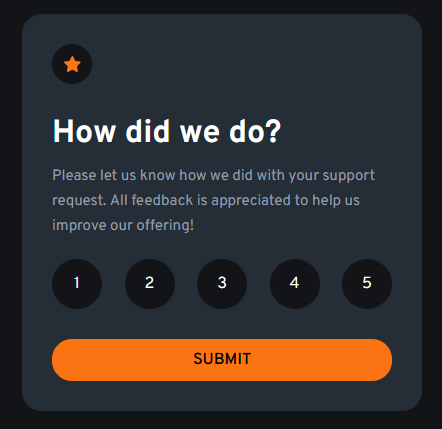
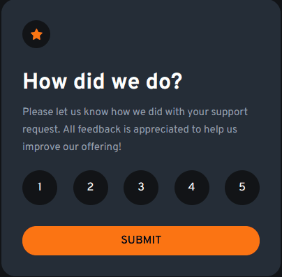
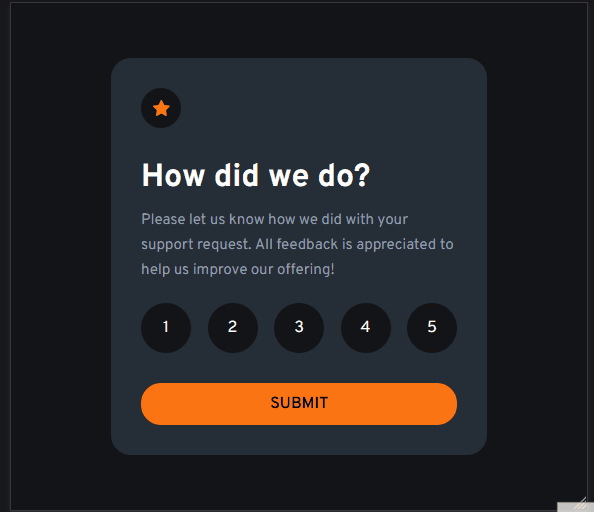

<h1 align="center">Interactive-rating-component-main</h1>

  Projeto da <a href="https://www.frontendmentor.io/challenges/interactive-rating-component-koxpeBUmI">Front-End Mentor</a>.

 

  

## 🚀 Tecnologias

Esse projeto foi desenvolvido com as seguintes tecnologias:

- HTML e CSS(Responsividade)

OBS: Irei fazer a parte de JavaScript quando começar a estudar.

## 💻 Projeto

Projeto para entrar nos conceitos de Front-End e desenvolvimento web.

## Como ficou o projeto online

  

   
   

  

